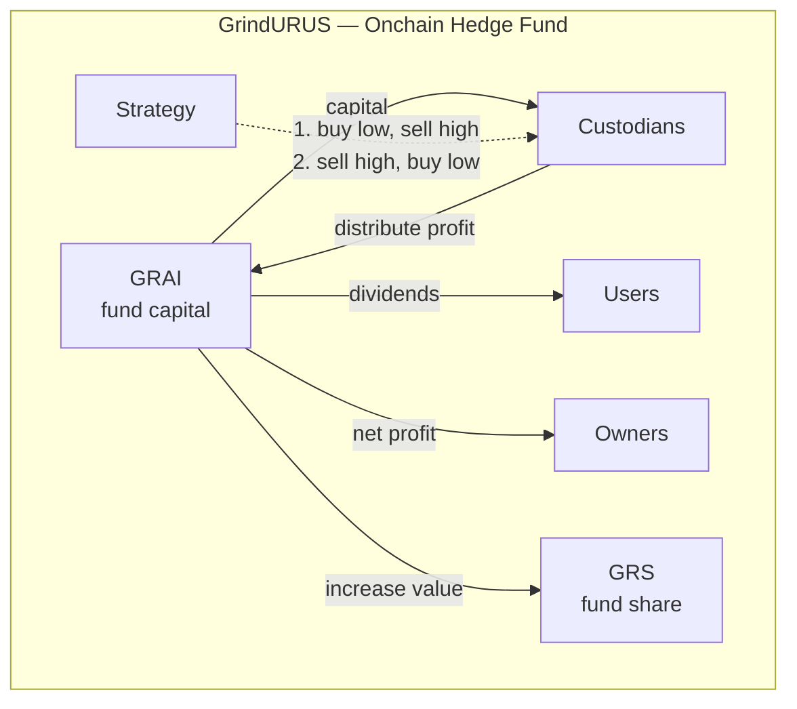

# Manifesto

Prices move every second; markets are liquid. That is sufficient.

## The opportunity

Assets' **realized volatility** fluctuates every second.

Day by day, spot can move **±0–8%** on majors and **±10%+** on alts — often without a clean trend.

Most on-chain yield is a side effect of something else — lending your balance, LP inventory, or solvency.

## The solution

**GrindURUS** utilizes the fluctuations. On blue chip assets software trades the weekly ±3–8% (and larger alt) swings through real terminals — Binance, CoW, LiFi, Jupiter, etc.

Deposit, get **GRAI**: a dollar book-priced share of the fund while capital grinds in **Grinders** custodian wallets. When profit is **`distribute`**d on-chain, anybody can **claim** it on behalf of an account.

**GRS** is separate: one billion tokens, one genesis, fund share on the fee layer — not a second way into the same capital.

## What we believe

1. **Mathematics.** Underlying positional math turns realized volatility into **structural alpha** — edge from structure, not from colocation or massive compute per tick. At time **t**, the book decomposes as:
  **ψ(t) -> A·P + Q + a·p + q**
   **A**, **Q** — balances; **a**, **q** — structural alpha; **P**, **p** — prices. We build on math, not on a new story every quarter.
2. **DeFi & tokenized assets.** Over the next decade, tokenized real-world and on-chain inventory will grow from a niche into a large **24/7** market — open rules on-chain, not a black-box claim on someone else's balance sheet. Volatility that never sleeps needs infrastructure that never stops grinding: book-priced shares, reported profit, governed fund, and automated market taking while holders stay passive.
3. **Intents & composable terminals.** Markets are moving from open orders to signed intents and solvers; liquidity is split across chains, venues, and networks. What scales is not another single-venue bot but a layer that executes both sides wherever liquidity appears — CEX, AMM, or intent network — with the same math underneath.
4. **Agent economy.** On-chain agents will settle, rebalance, and trade at scale — but not every wallet can run heavy models. The stack needs market taking from simple rules and math with O(1), not from massive compute per tick on tensor processing units.

## We are not

- A CEX/DEX or a copy-trading feed.
- A prediction market or a direction bet.
- A live-redeem stablecoin-style vault.

## We are

An **algorithmic quantitative on-chain hedge fund** that grinds realized volatility through rules.

## Who this is for

**Investors** who want volatility yield without running infrastructure — GRAI in the app.

**Private clients** who want the same machinery on their own pair and treasury.

**Agents** with wallets and balances that need to grind volatility without running a desk or heavy models per tick.

**Builders** who read the mechanics and integrate after audits ship.