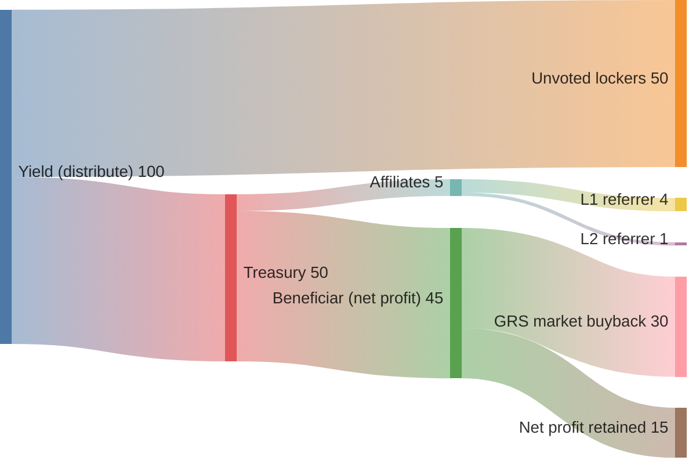

# Overview

GrindURUS is **extended accounting** with an on-chain fund layer (**GRAI**). See [Protocol](../protocol/overview.md), [GRAI](../grai/overview.md), [GRS](../grs/overview.md), [Treasury](../grai/treasury-and-affiliates.md).

## Two layers

**Off-chain (protocol repo)** — trading bots called **Grinders**. Each Grinder runs **GrindURUS** strategy in two modes on one pair:

- **DIRECT** — buy low, sell high → grow the quote asset (e.g. USDC)
- **INVERSE** — sell high, buy low → grow the base asset (e.g. ETH)

Adapters connect to Binance, CoW Protocol, LiFi, Jupiter, and other terminals. **Boss** starts and monitors Grinder containers.

**On-chain (evm + solana repos)** — the fund and governance:


| Contract / program | Token or NFT      | Role                         |
| ------------------ | ----------------- | ---------------------------- |
| GRAI               | GRAI (6 decimals) | USD book-priced share        |
| Grinders           | GRINDERS NFT      | Custodian wallets + reserve  |
| Treasury           | GRAI-TREASURY NFT | Affiliate tree + fee routing |
| GRS                | GRS (1B cap)      | Protocol equity              |


## Typical holder path

1. Deposit USDC (or another listed asset) into **GRAI**.
2. Receive GRAI at the current book (`totalValue`).
3. Optionally **lock** GRAI to earn asset dividends on the unvoted portion.
4. Custodians trade allocated capital; yield returns via `**distribute**`.
5. **Claim** dividends, or exit via secondary market / unlock / liquidation redeem.


## GRAI vs GRS


|              | **GRAI**                          | **GRS**                        |
| ------------ | --------------------------------- | ------------------------------ |
| Supply       | Elastic (grows with deposits)     | Fixed **1 billion** at genesis |
| Price anchor | USD book (`totalValue`)           | Market + protocol fee claim    |
| Use          | Fund share, lock, vote, dividends | Equity, revenue routing target |


GRAI is the **deposit receipt** for the volatility fund. GRS is **protocol stock**, not a second fund share.

## Architecture


### End-to-end flow

```
Depositor
    │ deposit(asset)
    ▼
  GRAI ──mint at book──► GRAI tokens
    │ assets
    ▼
 Grinders reserve
    │ allocate (owner)
    ▼
 Custodian NFT wallet ──trade──► yield on wallet
    │ distribute (owner reports profit)
    ▼
  GRAI.distribute
    ├─ dividendCut (~50%) ──► unvoted lockers (claim)
    └─ treasuryCut (~50%) ──► Treasury
              ├─ revenueShare (5% of yield) ──► affiliates on claim
              └─ remainder ──► beneficiar (net profit)
```


### Protocol map

GRAI actors: locker, voter, briber, referrer, poacher


| Actor                  | Role                                                               |
| ---------------------- | ------------------------------------------------------------------ |
| **Depositor / holder** | Mints GRAI; may lock in the same tx                                |
| **Locker**             | Escrowed GRAI; earns dividends on `locked − voted`                 |
| **Voter**              | Adds to liquidation quorum; **no** asset dividends on voted amount |
| **Briber**             | Buys out voted GRAI for `settlementAsset`                          |
| **Referrer**           | Upline seat in Treasury tree; paid on downstream claims            |
| **Poacher**            | Buys a locker’s upline link for GRAI (`poach`)                     |
| **Grinders owner**     | Allocates capital, registers custodians, arms liquidation          |


### Networks

The same logic is implemented on **EVM** (Solidity, UUPS where noted) and **Solana** (Anchor). GRS uses **LayerZero OFT** for cross-chain representation: one **home** chain mints 1B; **spokes** bridge 1:1.

### Repositories

See [Repositories](../developers/repositories.md) for the full map of `grindurus-protocol`, `grindurus-evm`, `grindurus-solana`, `grindurus-app`, and related trees.

## Tokenomics


### Yield split (default GRAI config)

When custodians report profit via `distribute`:


| Cut          | Default                | Destination                                |
| ------------ | ---------------------- | ------------------------------------------ |
| **Dividend** | 50% (`dividendCutBps`) | Unvoted locked GRAI → `claim` / `claimAll` |
| **Treasury** | 50% (`treasuryCutBps`) | Treasury contract                          |


If nobody qualifies for dividends (`totalLocked == totalVoted`), the dividend cut goes to Treasury instead.

### Revenue flow

Per **100** of reported yield (illustrative; defaults above). Affiliate L1/L2 is **80/20** of the 5% revenue-share pool. The beneficiar remainder (~45 of gross) is **net profit**; buybacks are an intended use of that cut (~30 of gross), not a separate on-chain cut.




### Treasury → affiliates → beneficiar

From the treasury cut:


| Slice             | Default                         | When                                          |
| ----------------- | ------------------------------- | --------------------------------------------- |
| **Revenue share** | 5% of yield (`revenueShareBps`) | Paid to L1/L2 referrers on locker `**claim`** |
| **Remainder**     | ~45% of gross yield             | `Treasury.beneficiar` — **net profit**        |


At launch `beneficiar` is typically `GRAI.owner()`. Part of net profit is intended for **open-market GRS buybacks** (~30% of distributed yield).

### Role ladder (GRAI)

```
                        poacher
                           │
                        poach()
                           ▼
holder → lock() → locker (unvoted) → vote() → voter ← bribe() ← briber
                      │                    │
                 earns dividends      no dividends; quorum seat
```

- Wallet GRAI earns **nothing** until locked.
- Only **unvoted** locked GRAI earns asset dividends.
- **Vote** is the price of a liquidation seat.
- **Poacher** buys the locker’s upline seat (`poach`) for GRAI — rewrites the referrer tree, not the cashflow NFT.


### GRS at a glance

- **1,000,000,000** fixed supply; single genesis on **home**.
- **15%** (150M) Token sales — public `buy` book, Instant gate.
- **20%** each: Investments, Affiliates, Team, Ecosystem, Foundation.
- Cap-table `**grant**` is `owner` on home; spokes revert `NotHome`.

Full bucket table: [GRS cap table](../grs/cap-table.md).

### What GRS is not

- Not a deposit receipt (that is GRAI).
- Not a custodian operator license (Grinders NFT).
- Not the affiliate cashflow NFT (GRAI-TREASURY).
- Not minted from yield — fee surplus only.


### Invariants (short)

1. GRAI book (`totalValue`) moves on deposit / redeem, not on custodian trades until `distribute`.
2. Circulating GRS never exceeds 1B across home + spokes.
3. `totalVoted ≤ totalLocked ≤ totalSupply`.
4. Liquidation open is **2-of-2**: vote quorum + Grinders `confirmed`.

