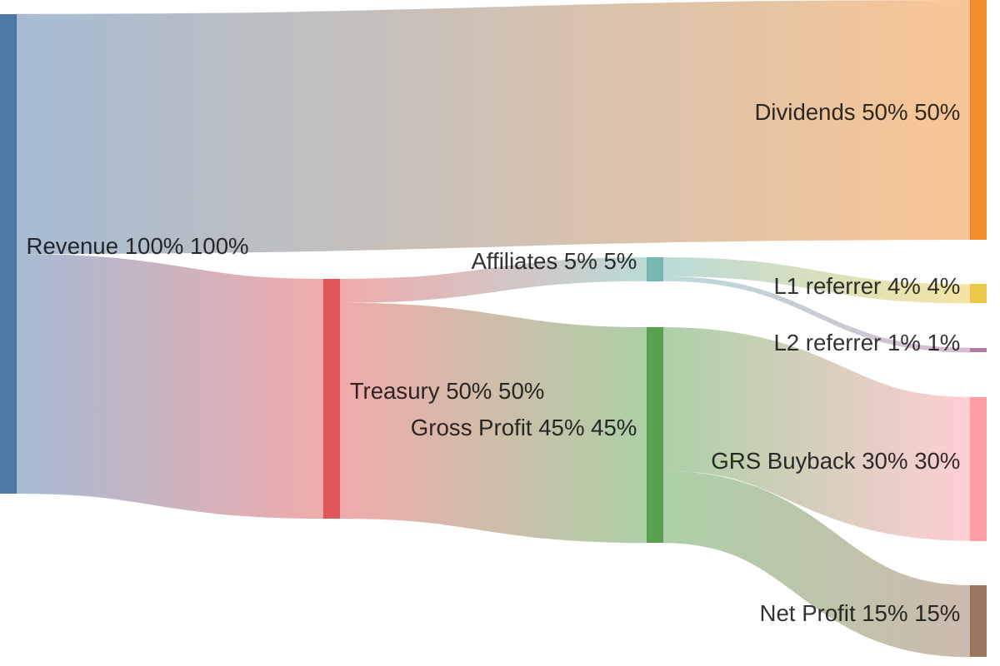

# Treasury and affiliates

**Treasury** receives the treasury cut from GRAI `distribute` (default 50% of reported yield). It manages:

- **Referrer tree** — who is upline for each locker
- **Volume books** — L1/L2 claimable USD books per seat
- **Cashflow NFT** — Metaplex 1/1 per locker; OTC-transferable claim payee
- **Affiliate payouts** on locker `claim`
- **`beneficiar`** — net remainder (target: GRS FeeVault)

## Revenue distribution

Per **100** of reported yield (GRAI defaults: `dividendCutBps` / `treasuryCutBps` = 50/50, `revenueShareBps` = 5%). Affiliate L1/L2 weights are **80/20** of the revenue-share pool.

On-chain split has two stages:

1. **`distribute`** — yield → dividend reserve (lockers) + Treasury inventory.
2. **`claim`** — when lockers take dividends, Treasury pays affiliates from inventory and sends the rest to `beneficiar`.

Buybacks are an **intended ops use** of beneficiar net (~30 of gross), not a separate on-chain cut.

| Slice | Default | When |
| ----- | ------- | ---- |
| Dividend cut | 50% of yield | Accrues to unvoted lockers; paid on `claim` |
| Treasury cut | 50% of yield | Lands in Treasury on `distribute` |
| Revenue share | 5% of yield | Paid to L1/L2 on locker `claim` (80/20) |
| Beneficiar | ~45% of gross | Remainder after affiliates |
| Claim tip | 1% of claimed asset | Paid to claim caller (out of locker payout; not shown above) |

## Referrer vs cashflow NFT

Two independent layers:

| Layer | What moves on OTC transfer | What `poach` changes |
| ----- | -------------------------- | -------------------- |
| **Referrer tree** | Nothing | Upline link + books |
| **Cashflow NFT** | Who receives claim slices | Nothing |

`referrerOf(locker)` is set on **first deposit** and changes only via `poach` / admin rebind.

## Affiliate pay on claim

When a locker **claims** dividends, Treasury pays referrers from its inventory:

| Level | Default share of claimed USD value |
| ----- | ---------------------------------- |
| L1 | 80% of revenue share slice |
| L2 | 20% |

Default `revenueShareBps` = **5%** of gross yield (configured on GRAI, enforced at claim time).

Each successful claim also **grows books** (`value`, `l1Value`, `l2Value`), raising future **poach** asks.

## Poach

`poach(locker)` buys the current upline seat for GRAI:

1. `previewPoach` quotes price from Treasury books.
2. Poacher pays **current referrer** in GRAI.
3. `rebind(locker, poacher)` rewrites the tree.

Blocked during liquidation. Cannot create referral loops.

## Beneficiar

Net treasury remainder after affiliate slices flows to **`beneficiar`**. Launch default: `GRAI.owner()`. Target: protocol FeeVault distributing to **GRS** stakers.

## GRAI-TREASURY NFT

Separate from Grinders custodian NFTs. Represents transferable **cashflow rights** on a locker’s affiliate stream without moving the referrer tree.

Metadata: [treasury.json](https://grindurus.xyz/treasury.json)

## App

Referral tree UI: [app.grindurus.xyz/grai](https://app.grindurus.xyz/grai) (manage / affiliates sections).

Spec: [Treasury.sol](https://github.com/grindurus/grindurus-evm/blob/main/src/Treasury.sol) · tests: `TreasuryReferrals.t.sol`, `TreasuryPoach.t.sol`
