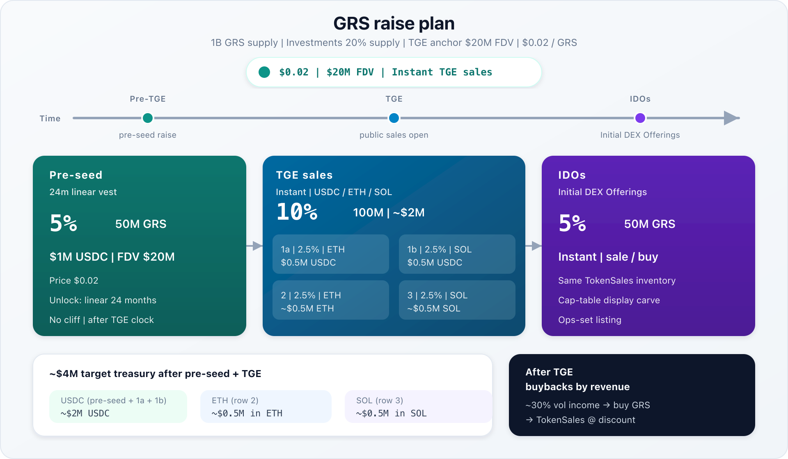

# Token sales

Public float from the **TokenSales** bucket soft plan: **150M GRS (15%)**, Instant gate, no vest — **10%** TGE sales + **5%** IDOs (cap-table display carve; same on-chain inventory).

| Slice | Share | GRS | When | Pricing |
| ----- | ----- | --- | ---- | ------- |
| **TGE sales** | 10% | 100M | At / around TGE | Flat **$0.02** → **$20M FDV** |
| **IDOs** | 5% | 50M | Initial DEX Offerings | Ops-set listing via `sale` / `buy` |

Pre-seed is a separate bucket (5%, $1M USDC, 24m linear) — see [Cap table](https://docs.grindurus.xyz/grs/cap-table).

## Raise plan (target)



Source: [token-sales.svg](./token-sales.svg)

Supply **1B GRS**. TGE anchor: **$20M FDV** ↔ **$0.02 / GRS**.

### Pre-seed

| | |
| --- | --- |
| Allocation | **5%** (50M) — Pre-seed bucket |
| Raise | **$1M USDC** |
| Price / FDV | $0.02 / $20M |
| Unlock | Linear **24m** after TGE, no cliff |

### TGE sales — 10% (100M), four `sale` rows

All rows at the same TGE price (**$0.02**, FDV **$20M**). Instant unlock via `buy`.

| # | Chain | Quote asset | Share | GRS | Target raise | Notes |
| - | ----- | ----------- | ----- | --- | ------------ | ----- |
| 1a | Ethereum | **USDC** | 2.5% | 25M | ~$0.5M | Round 1 — pay USDC on ETH |
| 1b | Solana | **USDC** | 2.5% | 25M | ~$0.5M | Round 1 — pay USDC on SOL |
| 2 | Ethereum | **ETH** | 2.5% | 25M | ~$0.5M | Pay in ETH |
| 3 | Solana | **SOL** | 2.5% | 25M | ~$0.5M | Pay in SOL |
| **TGE total** | | | **10%** | **100M** | **~$2M** | USDC + ETH + SOL |

Round 1 is one **5%** tranche as **two USDC rows** (2.5% on Ethereum + 2.5% on Solana). Rows 2–3 take native gas assets.

**Target treasury mix after pre-seed + TGE sales:**

- **~$2M USDC** — pre-seed $1M + TGE rows 1a/1b (~$0.5M each)  
- **~$0.5M ETH** — row 2  
- **~$0.5M SOL** — row 3  

Quote mint / native asset per row is set when the owner calls `sale`.

**50M** (5%) is the **IDOs** slice (Initial DEX Offerings) — same TokenSales on-chain inventory, separate row on the [cap table](https://docs.grindurus.xyz/grs/cap-table).

## After TGE — fee buyback → TokenSales

Protocol yield (`GRAI.distribute`) splits ~50% dividends / ~50% treasury. After affiliates, roughly **~30% of distributed volatility income** is intended to route via `beneficiar` / FeeVault into **buying GRS on the open market**. See [GRS mechanics](https://docs.grindurus.xyz/developers/mechanics/grs) and [GRAI — Treasury](https://docs.grindurus.xyz/grai/treasury-and-affiliates).

Buybacks use the **protocol cut**, not the locker dividend cut.

**Recycle:** purchased GRS are returned to **TokenSales** escrow inventory (EVM `address(this)` / Solana `sale_escrow`). On-chain TokenSales is **uncapped** for this path — buybacks can re-enter the book beyond the genesis 150M plan. Ops then list them again with `sale` / `buy` at a **discount** (ops-set). Fee surplus buys spot and re-offers protocol equity below market.

## Book model

Each sale row has:

| Field | Meaning |
| ----- | ------- |
| `id` | 1-based, assigned on `sale` |
| `asset` | Native (`0`) or ERC-20 / SPL mint as `bytes32` |
| `assetAmount` | Remaining quote asset for sale |
| `grsAmount` | Remaining GRS at this id |
| `recipient` | Payee for `buy`; empty → owner / admin |

Row **closes** when either remainder hits zero.

TGE calendar above = up to **four** rows from the 100M TGE slice. IDOs and buybacked GRS are listed as further `sale` rows when ops chooses.

## Home lists, spoke sells

**Home** (owner):

```
sale(asset, assetAmount, grsAmount, recipient, dstEid)
```

| `dstEid` | Behavior |
| -------- | -------- |
| `0` | Local listing only; no LZ burn |
| ≠ `0` | Burns `grsAmount` from TokenSales inventory; LZ-publishes row to spoke |

**Spoke** `lzReceive`:

- Writes the sale row (`SaleAccepted`)
- Mints that GRS into **escrow** for buyers

Solana: `sale` appends locally; `publish_sale` performs the LZ hop (burn from `sale_escrow`).

## Buy

Anyone calls `buy(id, grsAmount, to)`:

1. Cost = `floor(grsAmount × assetAmount / remaining GRS)` (full remainder pays exact `assetAmount`).
2. Pay `recipient` in native / ERC-20 / SPL.
3. Receive GRS instantly from escrow — no vest.

Previews:

- EVM: `quoteBuy(id, grsAmount)`
- Solana: `quote_buy(id, amount)`
- LZ fee quote: `quoteSale(asset, …, dstEid)` / `quote_sale(dst_eid, id)`

## Limits

- Genesis soft plan **150M** TokenSales float (TGE **100M** + IDOs **50M**); on-chain bucket is **uncapped** so buybacks can re-enter inventory.
- Buybacked GRS → TokenSales escrow → relist at a **discount**.
- `buy` never mints — only transfers from escrow.
- Do not `grant(TokenSales)` and LZ-publish the same GRS twice.
- Buyback-resale price is an ops-set **discount** to market.

## App

GRS page: [app.grindurus.xyz](https://app.grindurus.xyz) — sales list, preview, buy (when deployments are wired).
